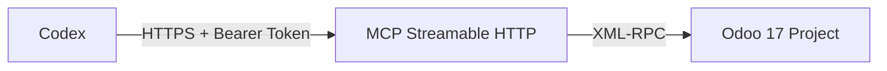

# MCP مدیریت پروژه Odoo 17

این پروژه یک MCP Server امن و قابل‌دسترسی از راه دور برای اتصال Codex به اپ رسمی **Project** در
Odoo 17 است. روش اصلی اجرا یک سرویس دائمی **Streamable HTTP** با Bearer Token است. ارتباط با Odoo
از API رسمی XML-RPC انجام می‌شود و هیچ ماژول سفارشی Odoo لازم نیست.

## معماری



مسیرهای پیش‌فرض:

- MCP: `http://SERVER_IP:31080/mcp`
- Health check عمومی: `http://SERVER_IP:31080/health`

مسیر `/mcp` بدون Token پاسخ 401 و با Token اشتباه پاسخ 403 می‌دهد. `stdio` فقط به‌عنوان روش قدیمی
و اختیاری باقی مانده است.

## قابلیت‌ها

- نمایش فقط پروژه‌های موجود در `ODOO_ALLOWED_PROJECT_IDS`
- محدودسازی اختیاری Developerها
- لیست، ساخت و ویرایش پروژه با Feature Flag جداگانه
- مشاهده و مدیریت ستون‌های برد مانند Backlog و In Progress
- ساخت، ویرایش، جابه‌جایی، آرشیو و حذف محافظت‌شدهٔ تسک
- Developer، Description، تخمین زمان، Deadline، Priority، Tag و Milestone
- Subtask، وابستگی و Blocked By
- تغییر مستقل ستون Kanban و State داخلی تسک
- Comment در Chatter و گزارش Workload
- Timesheet رسمی در صورت نصب `hr_timesheet`

هیچ ابزار عمومی برای انتخاب model، method، domain یا field دلخواه Odoo وجود ندارد.

برای پروژه‌های بزرگ، ابتدا `list_project_stages` را اجرا کن و سپس مثلاً از
`list_tasks(project_id=..., stage_name="In Progress", limit=25, offset=0)` استفاده کن. فیلتر ستون
داخل خود Odoo اجرا می‌شود، نه بعد از دریافت همهٔ تسک‌ها. خروجی لیست compact است و Description،
آرایه‌های Dependency و Timestampهای اضافی را برنمی‌گرداند؛ جزئیات کامل یک تسک را فقط با
`get_task(task_id)` بگیر.

## شروع سریع — Docker Compose (روش اصلی و پیشنهادی)

```bash
git clone https://github.com/fatemeh-mohseni-AI/Odoo17-Project_management-MCP.git
cd Odoo17-Project_management-MCP
cp .env.example .env
openssl rand -hex 32
```

Token تولیدشده و اطلاعات Odoo تست را داخل `.env` قرار بده:

```dotenv
ODOO_URL=http://odoo17-test:8069
ODOO_DB=mcp_test
ODOO_USERNAME=ai-project-service@example.com
ODOO_API_KEY=odoo-api-key
ODOO_ALLOWED_PROJECT_IDS=12
ODOO_ALLOWED_ASSIGNEE_USER_IDS=7,19

MCP_TRANSPORT=streamable-http
MCP_HOST=0.0.0.0
MCP_PORT=31080
MCP_AUTH_TOKEN=توکن-حداقل-۳۲-کاراکتری
MCP_PUBLISH_HOST=0.0.0.0
```

MCP را به network کانتینر Odoo وصل و سرویس دائمی را اجرا کن:

```bash
export ODOO_DOCKER_NETWORK=odoo17_mcp_test_net
chmod 600 .env
docker compose up -d --build
docker compose ps
curl http://127.0.0.1:31080/health
```

روی ماشینی که Codex نصب است:

```bash
export ODOO_MCP_TOKEN='همان مقدار MCP_AUTH_TOKEN'
nano ~/.codex/config.toml
```

```toml
[mcp_servers.odoo_project]
url = "http://SERVER_IP:31080/mcp"
bearer_token_env_var = "ODOO_MCP_TOKEN"
enabled = true
required = true
startup_timeout_sec = 30
tool_timeout_sec = 120
default_tools_approval_mode = "writes"

[mcp_servers.odoo_project.tools.delete_task]
approval_mode = "prompt"

[mcp_servers.odoo_project.tools.delete_timesheet]
approval_mode = "prompt"
```

سپس Codex را restart کن و با `codex mcp list` یا `/mcp` اتصال را ببین.

HTTP مستقیم فقط برای شبکهٔ خصوصی یا VPN مناسب است. برای اتصال از اینترنت، HTTPS و reverse proxy
استفاده کن. نمونهٔ Nginx در [`deploy/nginx.conf.example`](deploy/nginx.conf.example) قرار دارد.

## پیش‌فرض‌های امنیتی

- Streamable HTTP روش پیش‌فرض است و بدون `MCP_AUTH_TOKEN` حداقل ۳۲ کاراکتری اجرا نمی‌شود.
- allowlist خالی باعث توقف عادی سرویس می‌شود.
- ساخت پروژه و حذف دائمی به‌صورت پیش‌فرض خاموش‌اند.
- حذف دائمی علاوه بر Feature Flag به عبارت تأیید دقیق همان رکورد نیاز دارد.
- Stage سراسری یا مشترک با پروژهٔ غیرمجاز قابل ویرایش نیست.
- Tokenها، API Key، Description و Comment داخل audit log نوشته نمی‌شوند.

allowlist داخل MCP جای ACL و Record Rule اودو را نمی‌گیرد. برای MCP یک Service Account جدا با
حداقل دسترسی بساز.

راهنمای کامل: [نصب](docs/INSTALLATION.md) · [معماری فنی](docs/TECHNICAL.md) ·
[فهرست ابزارها](docs/TOOLS.md) · [امنیت](docs/SECURITY.md)
