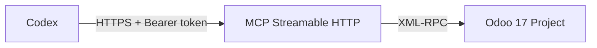

# Odoo 17 Project Management MCP

A security-focused, remotely accessible Model Context Protocol server for managing work in the
official **Odoo 17 Project** application. The primary runtime is a long-lived, authenticated
**Streamable HTTP** service. It supports self-hosted and Docker-based Odoo through the documented
XML-RPC external API.

> Status: alpha (`0.2.1`). Test against a staging Odoo database before enabling production writes.

[راهنمای فارسی](README.fa.md) · [Installation](docs/INSTALLATION.md) ·
[Technical architecture](docs/TECHNICAL.md) · [Tool catalog](docs/TOOLS.md) ·
[Security](docs/SECURITY.md)

## Architecture



Default endpoints:

- MCP: `http://SERVER_IP:31080/mcp`
- unauthenticated liveness check: `http://SERVER_IP:31080/health`

`/mcp` requires `Authorization: Bearer <MCP_AUTH_TOKEN>`. Missing credentials return HTTP 401 and
an invalid token returns HTTP 403. `stdio` remains available only as an explicitly selected legacy
transport.

## What it supports

| Area | Capabilities |
|---|---|
| Access boundary | Mandatory project-ID allowlist; optional assignee allowlist; indirect records are re-checked |
| Projects | List, read, create (feature-gated), and update planning settings |
| Board columns | List, create, reorder and edit project-scoped task stages |
| Tasks | Compact stage-filtered search, full single-task read, create, update, move, archive/unarchive and protected hard-delete |
| Planning | Assignees, estimates, deadlines, priority, workload, dependencies and blockers |
| Structure | Subtasks and milestones |
| Classification | Project tags and task tag assignment |
| Collaboration | Task chatter comments as the configured service account |
| Status | Independent Kanban stage and Odoo task-state changes |
| Time tracking | Official Timesheets integration when `hr_timesheet` is installed |

There is deliberately **no generic `execute_kw`, model, domain, field or method tool**. The MCP
cannot be converted into unrestricted access to the rest of Odoo.

For large projects, call `list_project_stages` once and then use
`list_tasks(project_id=..., stage_name="In Progress", limit=25, offset=0)`. The stage filter runs
inside Odoo, not after retrieval. List results exclude descriptions, dependency arrays and audit
timestamps; use `get_task(task_id)` only for a selected task's full details.

## Quick start — Docker Compose (recommended)

```bash
git clone https://github.com/fatemeh-mohseni-AI/Odoo17-Project_management-MCP.git
cd Odoo17-Project_management-MCP
cp .env.example .env
openssl rand -hex 32
```

Copy the generated token into `MCP_AUTH_TOKEN` and configure the Odoo service account and approved
database IDs in `.env`:

```dotenv
ODOO_URL=http://odoo17-test:8069
ODOO_DB=mcp_test
ODOO_USERNAME=ai-project-service@example.com
ODOO_API_KEY=replace-with-an-odoo-api-key
ODOO_ALLOWED_PROJECT_IDS=12
ODOO_ALLOWED_ASSIGNEE_USER_IDS=7,19

MCP_TRANSPORT=streamable-http
MCP_HOST=0.0.0.0
MCP_PORT=31080
MCP_AUTH_TOKEN=replace-with-the-generated-token
MCP_PUBLISH_HOST=0.0.0.0
```

Attach the MCP container to the Odoo Docker network and start the persistent service:

```bash
export ODOO_DOCKER_NETWORK=odoo17_mcp_test_net
chmod 600 .env
docker compose up -d --build
docker compose ps
curl http://127.0.0.1:31080/health
```

Connect Codex from another machine:

```bash
export ODOO_MCP_TOKEN='the-same-value-as-MCP_AUTH_TOKEN'
```

```toml
[mcp_servers.odoo_project]
url = "http://SERVER_IP:31080/mcp"
bearer_token_env_var = "ODOO_MCP_TOKEN"
enabled = true
required = true
startup_timeout_sec = 30
tool_timeout_sec = 120
default_tools_approval_mode = "writes"

[mcp_servers.odoo_project.tools.delete_task]
approval_mode = "prompt"

[mcp_servers.odoo_project.tools.delete_timesheet]
approval_mode = "prompt"
```

Use direct HTTP only on a trusted private network/VPN. For traffic crossing an untrusted network,
terminate HTTPS in a reverse proxy; an example is provided in
[`deploy/nginx.conf.example`](deploy/nginx.conf.example).

See the [installation guide](docs/INSTALLATION.md) for ID discovery, firewall/TLS guidance, local
Python installation, troubleshooting, and the optional legacy stdio mode.

## Safe defaults

- Streamable HTTP is the default transport and cannot start without a bearer token of at least 32
  characters.
- An empty project allowlist stops normal operation unless creation-only bootstrap is explicitly
  enabled.
- Project creation and permanent deletion are off by default.
- Hard deletion additionally requires an exact record-specific confirmation phrase.
- Credentials are never returned by tools or written to audit logs.
- Global stages and stages shared with a disallowed project are read-only through this MCP.

The MCP allowlist is a second boundary, not a replacement for Odoo ACLs and record rules. Use a
dedicated least-privilege Odoo account restricted to the same projects.

## Compatibility

- Odoo major version: **17 only**
- Odoo deployment: self-hosted package or Docker, reachable over HTTP(S)
- Default MCP transport: Streamable HTTP on `/mcp`
- Optional legacy transport: stdio with `MCP_TRANSPORT=stdio`
- MCP SDK: official Python SDK `2.x`
- Timesheets: official `hr_timesheet` feature required

## Development

```bash
make install
make lint
make test
make build
```

See [CONTRIBUTING.md](CONTRIBUTING.md). Licensed under the [MIT License](LICENSE).
