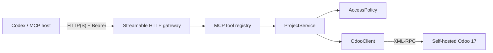

# Technical architecture

## Goals and boundaries

The server exposes task-planning operations from the official Odoo 17 Project application to an MCP
host. Its primary boundary is a configured set of Odoo `project.project` database IDs. The service
does not expose a generic ORM proxy and does not support other ERP domains.

The attached Odoo 17 introspection guide used for the initial design identifies the relevant
official models and fields: `project.project`, `project.task`, `project.task.type`, `project.tags`
and `project.milestone`. Timesheets are feature-detected through the official
`account.analytic.line` extension rather than assumed to exist in the base module.

## Components



| Component | Responsibility |
|---|---|
| `server.py` | Typed MCP tools and transport selection; HTTP is the default |
| `http_transport.py` | `/mcp`, `/health`, bearer authentication and Uvicorn lifecycle |
| `service.py` | Project-domain behavior, validation, record resolution and audit events |
| `policy.py` | Project/assignee allowlists and durable IDs for projects created by the MCP |
| `odoo.py` | Odoo 17 version check, authentication, timeouts and narrow ORM helper calls |
| `config.py` | Environment parsing and fail-closed configuration validation |
| `cli.py` | Read-only administrator discovery outside the AI/MCP surface |

## Request lifecycle

1. The HTTP gateway validates `Authorization: Bearer ...` with a constant-time comparison. Missing
   authentication returns 401 and invalid credentials return 403.
2. The MCP SDK establishes a Streamable HTTP session and validates protocol messages.
3. Codex chooses a typed tool; it cannot provide an Odoo model or method name.
4. The MCP SDK validates JSON arguments from the generated input schema.
5. `ProjectService` resolves referenced records from Odoo.
6. It derives the actual `project_id` from each record, rather than trusting a caller-provided
   relationship.
7. `AccessPolicy` checks that project and any restricted assignees are allowed.
8. Cross-record constraints are checked (stage/tag/milestone/parent/dependency belongs to the same
   project or is an allowed global record).
9. The narrow Odoo operation runs as the configured service account.
10. A metadata-only audit line is written for writes. Descriptions, comments and
   credentials are omitted.
11. The result is read back from Odoo and returned to the MCP host.

All blocking XML-RPC calls run in a worker thread. `OdooClient` serializes access with a re-entrant
lock because Python `ServerProxy` transports are not treated as safely concurrent. This favors
correctness over parallel RPC throughput for the first release.

## Odoo protocol

The client uses the documented endpoints:

- `/xmlrpc/2/common` for `version()` and `authenticate()`
- `/xmlrpc/2/object` for `execute_kw()`

The reported major version must be 17 before credentials are accepted for model calls. HTTPS uses
the platform trust store and certificate verification by default. Plain HTTP remains supported for
a private Docker network. RPC calls have a configurable timeout.

No context, domain, model, fields or method values originate from MCP callers. Domains and field
lists are constants or are assembled from validated, typed arguments.

## Large-project and token-efficiency design

`list_tasks` is a summary query, not a task-detail query. Its default page size is 25 and its hard
maximum is 100. When `stage_name` is supplied, the service first resolves that exact,
case-insensitive name among the selected project's own and global stages. It then adds the resolved
`stage_id` to the Odoo `search_read` domain, so unrelated tasks never cross the XML-RPC boundary.
Missing or duplicate names fail explicitly; callers can use `stage_id` to disambiguate.

The summary field list contains only planning identifiers and short scalar/relation values. Large
HTML descriptions, dependency/child ID arrays and audit timestamps are returned only by `get_task`
for a specific task. `offset` provides bounded pagination. `get_project_board` is retained for small
boards but now defaults to 50 and cannot return more than 100 tasks.

Before reads, field metadata is capability-checked and cached. Group-protected optional fields such
as `milestone_count` are omitted when the Odoo service account cannot read them, rather than causing
all project/task tools to fail.

## Odoo model mapping

| MCP concept | Odoo 17 model / fields |
|---|---|
| Project | `project.project`: `name`, `description`, `date_start`, `date`, `privacy_visibility` |
| Task | `project.task`: `project_id`, `name`, `description`, `allocated_hours`, `date_deadline` |
| Assignees | `project.task.user_ids` to active internal `res.users` |
| Kanban column | `project.task.type` through `stage_id` and `project_ids` |
| Task status | `project.task.state`; valid selection values come from `fields_get` |
| Subtask | `project.task.parent_id` / `child_ids` |
| Dependency | `project.task.depend_on_ids` / `dependent_ids` |
| Tag | `project.tags` and `project.task.tag_ids` |
| Milestone | `project.milestone` and `project.task.milestone_id` |
| Comment | `project.task.message_post()` using `mail.mt_comment` |
| Time entry | `account.analytic.line`: `project_id`, `task_id`, `unit_amount`, `date`, `user_id` |

### Stage and state are different

`stage_id` controls the visible board column such as Backlog or In Progress. `state` is a separate
Odoo selection used for values such as In Progress, Done or Canceled. The server exposes separate
tools and introspects state keys so it does not hard-code database-specific selection values.

### Global/shared stage safety

A stage with no `project_ids` is global. A stage can also be shared by several projects. An allowed
project may use such a stage for task movement, but changing its name, sequence or fold flag could
affect a disallowed project. Therefore stage updates are permitted only when `project_ids` is
non-empty and every linked project is in the MCP allowlist. New stages are scoped to exactly one
project.

## Policy model

The effective allowed project set is:

```text
ODOO_ALLOWED_PROJECT_IDS union state.created_project_ids
```

An empty set fails configuration unless `ODOO_ALLOW_PROJECT_CREATION=true`. When creation succeeds,
the returned ID is added to memory before any further operation and then atomically written to the
state file. The file is created with mode `0600`. A persistence error does not hide the fact that
Odoo already created the project; the tool returns a warning and keeps it allowed for the process.

`ODOO_ALLOWED_ASSIGNEE_USER_IDS` is optional. When configured, every task or timesheet user must be
in that set and must also resolve to an active, non-portal Odoo user.

## Write and delete semantics

- Update tools accept explicit fields; separate `clear_*` flags prevent omission from accidentally
  clearing existing data.
- Dates use `YYYY-MM-DD`. Task deadlines may also use ISO 8601 date-times. Timezone-aware values are
  normalized to UTC in Odoo's naive UTC format. A date-only task deadline means end of that date.
- Task creation/edit validates parent, blocker, tag, stage and milestone relationships before write.
- Archive is reversible and available without the hard-delete gate.
- `unlink` requires `ODOO_ENABLE_HARD_DELETE=true` and a record-specific phrase such as
  `DELETE TASK 42` or `DELETE TIMESHEET 81`.
- Tool annotations mark reads, normal writes and destructive writes so MCP hosts can apply approval
  policy.

## Timesheet feature detection

The base Project module does not guarantee task timesheet fields. On first timesheet use, the server
calls `fields_get` for `account.analytic.line` and requires `task_id`, `project_id`, `unit_amount`,
`date`, `name` and `id`. Missing fields or missing access produces `CapabilityUnavailableError` with
an instruction to enable the official Timesheets feature or adjust the service account.

Every time entry is read first and its actual `project_id` is policy-checked before update/delete.

## Error behavior

- Configuration errors name the missing/invalid variable but never include its value.
- Authentication errors do not echo a password or API key.
- Out-of-policy and missing linked records use deliberately similar errors to avoid an existence
  oracle.
- Odoo XML-RPC faults are truncated to a safe diagnostic tail.
- Missing HTTP bearer credentials return 401; malformed bearer credentials return 401; a
  well-formed but incorrect token returns 403.
- Tool calls rely on the MCP SDK's normal Streamable HTTP error responses. Application logs never
  include either the Odoo secret or the MCP bearer token.

## Audit event shape

Write operations produce a single structured JSON object prefixed by `audit`:

```json
{"action":"update","model":"project.task","record_ids":[42],"project_id":12,"fields":["stage_id"],"odoo_uid":7}
```

Log aggregation, retention and tamper resistance belong to the container/platform. The MCP does not
store audit records in Odoo or a separate database.

## Test strategy

The unit suite uses an in-memory fake Odoo client and covers:

- fail-closed configuration;
- default Streamable HTTP configuration and token-strength validation;
- public `/health`, missing-token 401 and invalid-token 403 behavior;
- a real MCP initialize/list-tools exchange through the authenticated ASGI application;
- state-file permissions and reload;
- direct and indirect project denial;
- assignee, stage and related-record validation;
- global stage write protection;
- live task-state selection validation;
- permanent-delete confirmation;
- created-project policy registration;
- timesheet policy enforcement;
- mandatory allowlist domain on task list queries.

CI runs tests, Ruff, mypy and a Docker build on supported Python versions. A live Odoo integration
suite is intentionally separate because it requires a seeded Odoo 17 database and credentials.

## Transport model

`MCP_TRANSPORT=streamable-http` is the default. The process constructs the MCP SDK's Streamable HTTP
ASGI application, wraps it in a small bearer-auth gateway, and runs one Uvicorn worker. `/health`
is a public process-liveness endpoint and does not query Odoo. `/mcp` and every other HTTP route are
authenticated. `MCP_TRANSPORT=stdio` bypasses the HTTP layer for backward compatibility only.

Static bearer authentication is intentionally simple for a single trusted deployment. It is not
an OAuth authorization server and does not issue tokens. TLS termination and external rate limits
belong at the reverse proxy or infrastructure layer.

## Known limitations in 0.2

- Odoo's standard XML-RPC API has no transaction spanning several tool calls; multi-task plans can
  partially apply if a later call fails.
- The first release serializes RPC calls inside one process.
- There is no attachment upload, customer portal sharing, invoicing or non-Project ERP access.
- HTTP authentication uses one static bearer token; there is no per-client identity or OAuth flow.
- Workload divides a task's allocated hours equally among multiple assignees and returns at most 500
  active tasks. It is a planning aid, not payroll/accounting data.
- Access still depends on Odoo ACLs and record rules; the MCP cannot grant rights the service user
  lacks.
